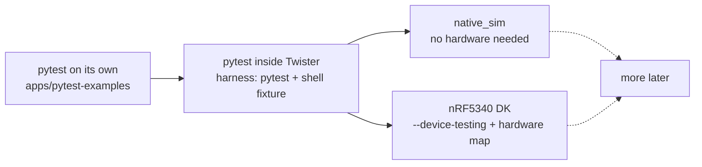

# Zephyr Pytest

A small repo where I work out how pytest works on its own, then use it through Twister's pytest harness to test a Zephyr app, on `native_sim` and on a real nRF5340 DK.

> **Status: exploratory.** I'm using this as supporting material for my workshop "Practical Embedded Automated Testing for Zephyr", but it is still me trying things out. Folders get renamed and tests get rewritten, so don't build on the layout yet.

## What's inside

- **[apps/pytest-examples](apps/pytest-examples/README.md)** - plain Python, no Zephyr. Numbered examples that go from a bare `assert` to fixtures, `parametrize`, three ways of laying out `src/` and `tests/`, and custom markers.
- **[apps/emul-shell-gpio](apps/emul-shell-gpio/README.md)** - a Zephyr button + LED app, plus a test image that presses the button through the GPIO emulator from a shell command (`test_btn`). pytest sends the command over the shell and checks the log line that comes back.
- **[apps/mcumgr-hello](apps/mcumgr-hello/README.md)** - a hello world with MCUboot and MCUmgr. pytest builds an UPDATED image, uploads it over MCUmgr, and checks that MCUboot boots it. Set up for the nRF5340 DK and the ESP32-S3.

## Two ways to lay out a Zephyr pytest test

| | Separate test image | Test next to the app |
|---|---|---|
| Layout | `app/tests/<suite>/` with its own `CMakeLists.txt`, `prj.conf`, `testcase.yaml`, `pytest/` | `app/testcase.yaml` + `app/pytest/`, one `CMakeLists.txt` |
| Use when | the test needs code or config that must not ship (backdoor commands, emulated peripherals) | you're testing the firmware as it ships |
| Example | [emul-shell-gpio](apps/emul-shell-gpio/README.md) | [mcumgr-hello](apps/mcumgr-hello/README.md) |

Zephyr's own `tests/` folder follows the first pattern, and its samples with a `pytest/` folder follow the second.

The order I went through it, and roughly where it goes next:



The step from A to B is small on the pytest side. Markers, fixtures and asserts work the same, and Twister adds a `shell` fixture that talks to the board over UART. Most of the new work is on the Zephyr side: the test image, the overlays, and getting the serial timing right.

## Requirements

Everything runs inside the devcontainer in [.devcontainer/](.devcontainer/devcontainer.json):

- Image `ghcr.io/royyandzakiy/zephyr-devcontainer-devel:z4.4.0-sdk1.0.1`
- Zephyr v4.4.0, Zephyr SDK 1.0.1, Python 3.12, pytest 9.1
- For real boards on Windows: the container bind-mounts `/dev`, and the USB probe has to be attached to WSL first (`usbipd`, or the usbip-connect extension that the container installs)
- macOS uses [.devcontainer/macos/](.devcontainer/macos/devcontainer.json), which has no USB passthrough, so it's `native_sim` only there

## Quick start

Open the repo in the devcontainer, then:

```bash
cd apps/pytest-examples/2_fixture && pytest -v && cd -
```

```bash
west twister -T apps/emul-shell-gpio/tests/emul_button_toggle -p native_sim/native
```

The first one is plain pytest. The second one builds the Zephyr test image, boots it on `native_sim`, and runs `tests/emul_button_toggle/pytest/` against its shell. Running it on the DK is in the [emul-shell-gpio README](apps/emul-shell-gpio/README.md).

## Project structure

```
zephyr-pytest/
├── .devcontainer/          # container config, plus a no-USB variant for macOS
├── apps/
│   ├── emul-shell-gpio/    # Zephyr app + separate test image under tests/
│   ├── mcumgr-hello/       # Zephyr app tested as it ships, pytest/ next to it
│   └── pytest-examples/    # plain pytest examples, read in number order
└── NOTES.md                # my scratch build/flash commands per board
```

## Limitations

- Only run inside the Linux devcontainer. I haven't tried a native Windows or macOS Zephyr install.
- On real hardware, Twister has run on the nRF5340 DK and the ESP32-S3. The Nucleo G474RE is in `platform_allow` and `hardware-map.yaml`, but untried.
- There is no CI yet. Everything here was run by hand.

## Roadmap

Nothing fixed yet. I'll probably keep adding things here as I explore more of what pytest and Twister can do together, so expect new apps and new numbered examples to show up, and old ones to get reshuffled.

## License

MIT - see [LICENSE](LICENSE).
