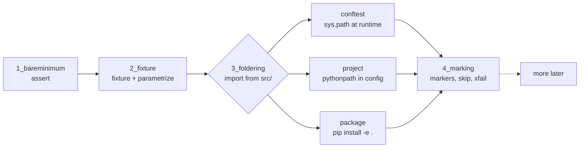
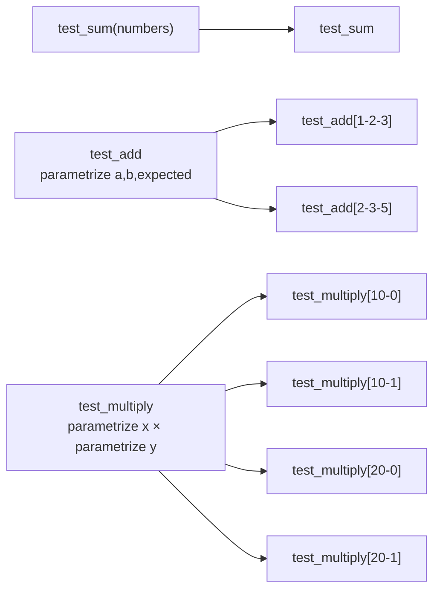
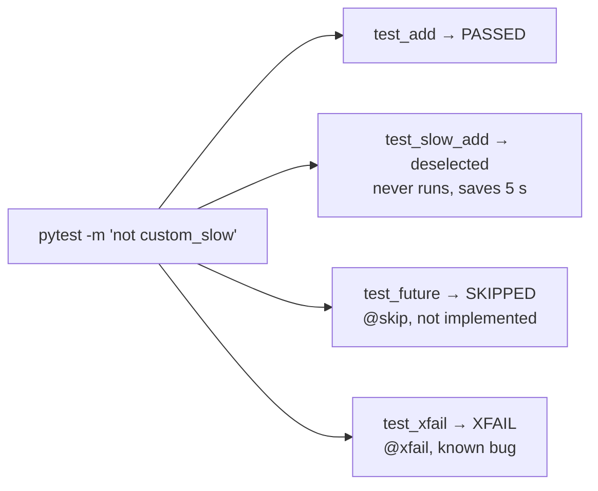

# pytest examples

Plain pytest, no Zephyr. I wrote these to get the basics straight before putting pytest behind Twister. They're numbered in the order I'd read them, and each folder runs on its own.

| Folder | What it shows | Run it |
|--------|---------------|--------|
| `1_bareminimum` | test discovery and plain `assert` (there's a commented-out failing line to try) | `pytest -v` |
| `2_fixture` | a `@pytest.fixture`, and stacked `@pytest.mark.parametrize` turning 3 functions into 7 tests | `pytest -v` |
| `3_foldering_conftest` | code in `src/`, tests in `tests/`, and a `conftest.py` that pushes `src/` onto `sys.path` | `pytest -v` |
| `3_foldering_package` | same layout, but `src/foldering/` is a real package installed with `pip install -e .` ([README](3_foldering_package/README.md)) | `pip install -e . && pytest -v` |
| `3_foldering_project` | same layout, no install and no `conftest.py`, just `pythonpath = ["src"]` in `pyproject.toml` | `pytest -v` |
| `4_marking` | a custom `custom_slow` marker registered in `pytest.ini`, plus `skip` and `xfail`, filtered with `-m` ([README](4_marking/README.md)) | `pytest -v -m "not custom_slow"` |

Run each one from inside its folder, since pytest picks the rootdir and config from where you start it.

## Where the 7 tests in 2_fixture come from

Three functions, seven tests. Each `parametrize` multiplies the function it sits on, and stacking two of them gives every combination:

`pytest --collect-only -q` prints exactly this list, which is a quick way to check what a stack of decorators turned into.

## Three ways to import from src/

The three `3_*` folders solve the same problem, which is getting `from calc import add` to work when `calc.py` lives in `src/`. `conftest.py` patches the path at runtime, `pythonpath` does the same thing from config, and the package version is the only one where the test imports the code the way a user of it would.

## What -m does in 4_marking

`-m` filters before anything runs, so a deselected test only appears as a count in the summary line (`1 deselected`). `skip` and `xfail` are decided per test and show up as their own results.

`4_marking` is the one that carries over to the Zephyr side: [1_gpio-emul-shell](../zephyr-examples/1_gpio-emul-shell/README.md) uses a `slow` marker the same way, passed through Twister with `--pytest-args="-m slow"`.

I'll probably add more folders here as I try other parts of pytest, so the numbering will keep growing.
